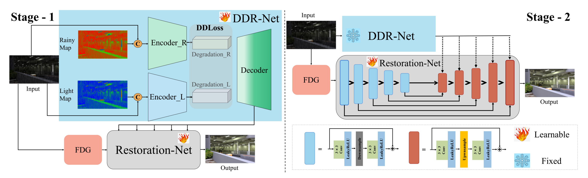

# [TCSVT] Dual Degradation Representation for Joint Deraining and Low-Light Enhancement in the Dark

### Xin Lin*, Jingtong Yue*, Sixian Ding, Chao Ren, Lu Qi and Ming-Hsuan Yang

)

## Abstract
Rain in the dark poses a significant challenge to deploying real-world applications such as autonomous driving, surveillance systems, and night photography. Existing low-light enhancement or deraining methods struggle to brighten low-light conditions and remove rain simultaneously. Additionally, cascade approaches like ``deraining followed by low-light enhancement'' or the reverse often result in problematic rain patterns or overly blurred and overexposed images. To address these challenges, we introduce an end-to-end model called L$^{2}$RIRNet, designed to manage both low-light enhancement and deraining in real-world settings. Our model features two main components: a Dual Degradation Representation Network (DDR-Net) and a Restoration Network. The DDR-Net independently learns degradation representations for luminance effects in dark areas and rain patterns in light areas, employing dual degradation loss to guide the training process. The Restoration Network restores the degraded image using a Fourier Detail Guidance (FDG) module, which leverages near-rainless detailed images, focusing on texture details in frequency and spatial domains to inform the restoration process. Furthermore, we contribute a dataset containing both synthetic and real-world low-light-rainy images. Extensive experiments demonstrate that our L$^{2}$RIRNet performs favorably against existing methods in both synthetic and complex real-world scenarios. 

## Dataset:

Baidu: https://pan.baidu.com/s/1yoEKRjimBlfecSMSx7uPQg     5atk 

Huggingface: https://huggingface.co/datasets/linxin020826/low_light_rainy_dataset/tree/main

## Requirements

Our experiments are done with:

- Python 3.7.13
- PyTorch 1.13.0
- numpy 1.21.5
- opencv 4.6.0
- scikit-image 0.19.3

## This is the Trasformer-based version.

## Contact
If you have any questions, please contact linxin@stu.scu.edu.cn
